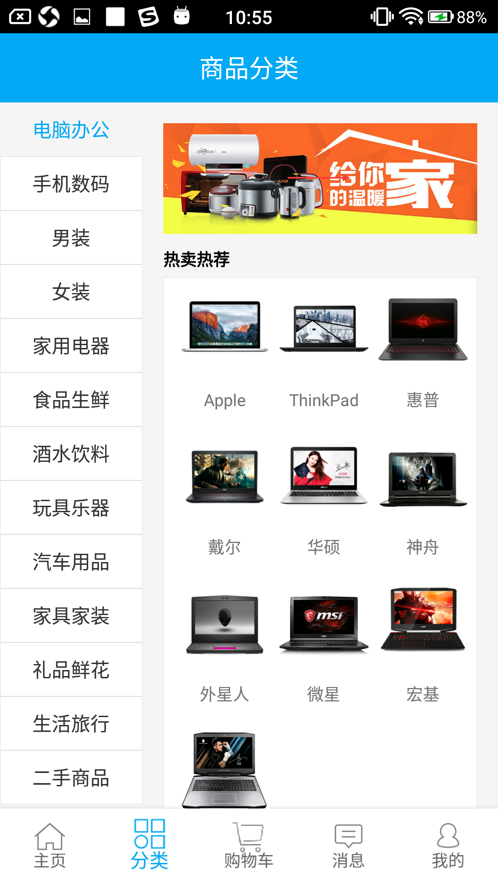
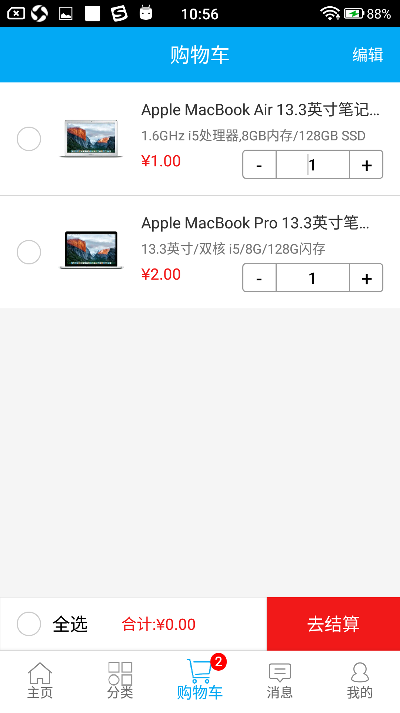
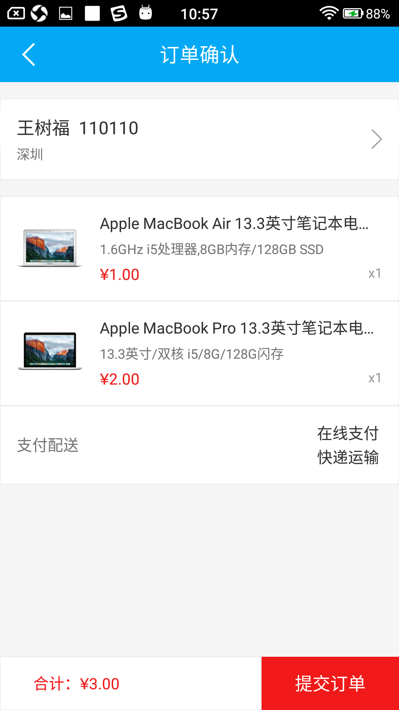
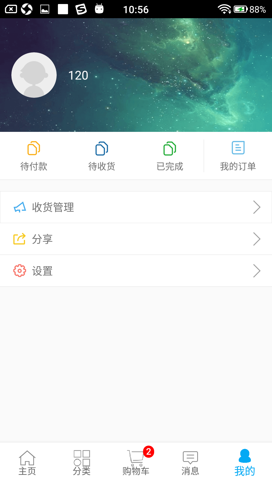
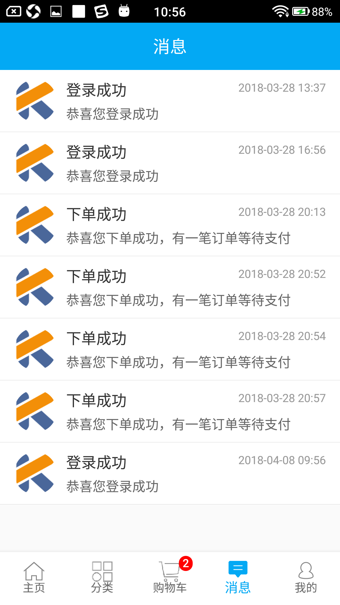

# AFMall
A pure shopping App based on Kotlin + ARouter + MVP + RxJava2 + Retrofit + Dagger2 + 七牛云 + Glide

###### tips:

+ 本项目是用作学习的目的
+ IDE中提示缺少了Dagger开头的class直接编译即可
+ 发现bug或者更好的建议欢迎[issue](https://github.com/wangshufu/AFMall/issues)、email(1109341050@qq.com)

#### Preview

 

 

 

 

#### Points

+ 整个项目采用kotlin语言编写
+ 使用ARouter框架进行模块间通信(页面的跳转以及服务管理)
+ 使用MVP架构模式开发(Presenter直接是实现方法的,所以没有契约类Contract)
+ 使用kotlin框架Kotlin-Android-Extensions、Anko
+ 使用注解神器Dagger2,将P层注入V层,无需new,直接用对象
+ 使用Rxjava进行业务数据处理
+ 使用RxLifecycle对Rxjava订阅的生命周期进行管理,防止OOM
+ 使用Rxbus进行组件间的通信
+ 使用Glide做图片处理和加载
+ 使用Retrofit网络请求框架
+ 使用okhttp3对日志、请求内容类型(json)、头部信息进行配置
+ 使用七牛云实现图片储存
+ 使用BGA-refreshlayout实现上拉刷新、下拉加载
+ 使用极光推送Jpush做消息推送服务

#### Version

##### V1.0.0

初步实现第一版

